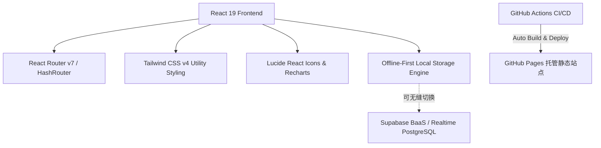

# 🏠 合租生活管家 (Roommate Life Manager)

> 为年轻合租群体量身打造的一站式生活协同平台。告别费用分摊扯皮、公共区域卫生推诿、耗材消耗无记录以及合租规则模糊等痛点。

[](https://github.com/Bruceqiu67/roommate-manager/actions/workflows/deploy.yml)
[](https://react.dev/)
[](https://vitejs.dev/)
[](https://tailwindcss.com/)
[](https://opensource.org/licenses/MIT)

---

## 🌐 在线体验 (Live Demo)

- **线上部署地址**: [https://bruceqiu67.github.io/roommate-manager/](https://bruceqiu67.github.io/roommate-manager/)
- **面试官快捷通道**: 登录页面提供 **「✨ 演示模式：一键填充数据体验（面试官通道）」** 按钮，无需繁琐注册，点击即可直接载入 3 人合租场景与全量真实业务数据（含多笔账单、待结算债务、值日排班、库存警戒与公约表决）。

---

## 💡 痛点与解决方案 (Problem & Solutions)

| 痛点场景 | 传统合租痛点 | 合租生活管家的解决方案 |
| :--- | :--- | :--- |
| **费用分摊** | 房租、水电燃气多方垫付，谁欠谁钱算不清 | **灵活多选 AA 分摊 + 债务轧差结算算法**：自动计算室友净额债务，一目了然生成最简转账路径 |
| **清洁排班** | 卫生轮流靠口头提醒，排班易混淆、易推诿 | **周期性日历排班 + 一键打卡履约**：责任清晰到人，未打卡状态实时跟踪 |
| **公共物品** | 垃圾袋/抽纸/洗洁精谁用完谁不管，断货才发现 | **耗材安全库存阈值 + 低库存自动告警**：消耗/补货随时记录，低于安全线触发全局预警 |
| **生活习惯** | 休息作息、外人留宿产生摩擦无规矩可依 | **公约提案发起 + 民主表决机制**：支持室友在线投票，多数赞成后正式生效沉淀为租住准则 |

---

## ✨ 核心功能模块 (Key Features)

### 1. 📊 仪表盘概览 (Overview Dashboard)
- **核心指标总览**: 本月支出总额、室友人数、待结算债务笔数、物品总览。
- **今日待办聚焦**: 自动呈现“今日清洁值日生”及打卡状态。
- **预警中心**: 即时浮现低于安全阈值的耗材物资，以及最新发起的室友公约状态。

### 2. 💰 费用 AA 分摊与结算 (Expenses & Settlement)
- **多分类记账**: 涵盖房租、水费、电费、燃气、网费、日用品、餐饮及其他类目。
- **动态参与人分摊**: 支持任意勾选共同分担的室友成员（非全员强制 AA，支持局部消费）。
- **债务智能结算中心 (Debt Netting)**:
  - 自动汇总每位成员的“已垫付”与“应分摊”金额；
  - 运用轧差算法消除冗余中间转账，直观提示如：`李四 应付 张三 ¥120.00`。

### 3. 🧹 清洁值日排班 (Cleaning Schedule)
- **区域任务划分**: 客厅、厨房、卫生间、阳台等多区域分工。
- **智能轮换排班**: 预设按天/按周轮换机制，自动为室友分配合理的值日周期。
- **履约打卡**: 实时记录打卡状态与完成时间，打卡结果即时反馈至仪表盘。

### 4. 📦 公共物品库存与提醒 (Shared Inventory)
- **耗材数字台账**: 记录品名、当前余量、单位（包/瓶/卷）及设定**安全库存阈值**。
- **极简操作**: 提供“消耗 1 个”、“快速补充”等一键便捷操作。
- **智能阈值预警**: 当库存数量 $\le$ 安全阈值时，触发黄色警告高亮，提醒室友集中补货。

### 5. 📜 室友公约与民主表决 (House Rules & Voting)
- **民主提议**: 任意室友均可拟定生活公约（如作息降噪时段、宠物管理、带客留宿报备等）。
- **全员投票表决**: 支持“赞成 / 反对”实时投票统计，透明公开。
- **公约状态机**: 经历 `待投票 (pending)` $\rightarrow$ `已生效 (active)` 或 `已否决 (rejected)` 全生命周期管理。

### 6. 👥 家庭组与室友管理 (Household & Members)
- **多家庭隔离**: 支持创建合租空间或凭唯一邀请码加入已有合租组。
- **室友名录**: 清晰列出家庭组内全部室友身份及联系方式。

---

## 🛠 技术架构与工程实践 (Tech Stack & Architecture)



- **Core Framework**: React 19 + Vite 8
- **Styling**: Tailwind CSS v4（最新一代 Vite 插件驱动，原生 CSS-first 编译）
- **Routing Robustness**:
  - 针对 GitHub Pages / 静态托管环境，采用 **`HashRouter`** 架构；
  - 构建阶段集成自定义插件自动生成 `404.html` 兜底，彻底根除 SPA 路由在页面刷新时出现的 `404 Not Found` 顽疾。
- **Data Layer & Offline-First**:
  - 设计轻量级响应式存储引擎（Reactive Store），基于 `localStorage` 实现离线优先与数据持久化；
  - 内置跨组件事件通知订阅机制，数据变更瞬间全局自动响应刷新；
  - 已预留 Supabase 客户端与环境变量配置，可无缝平滑切换为云端 PostgreSQL 数据库。
- **Lint & Code Quality**: 集成 Oxlint 现代化高速代码规范检查工具。

---

## 🚀 本地开发与启动指南 (Local Development)

### 1. 克隆代码仓库
```bash
git clone https://github.com/Bruceqiu67/roommate-manager.git
cd roommate-manager
```

### 2. 安装依赖
```bash
npm install
```

### 3. 启动本地开发服务器
```bash
npm run dev
```
启动成功后，在浏览器访问 `http://localhost:5173/` 即可。

### 4. 代码规范检查与打包构建
```bash
# 运行 Oxlint 快速检查
npm run lint

# 构建生产版本 (输出至 dist 目录)
npm run build

# 本地预览生产构建制品
npm run preview
```

---

## 🚢 持续集成与部署 (CI/CD Pipeline)

本项目采用 **GitHub Actions** 自动化流水线实现无缝持续交付：
1. **触发时机**: 当推送代码至 `main` 主分支时自动触发。
2. **流水线步骤**:
   - 检出源码（Checkout Code）；
   - 配置 Node.js 20 运行时环境与依赖缓存；
   - 执行 `npm ci` 和 `npm run build`；
   - 自动提取 `./dist` 产物并通过官方 `actions/deploy-pages@v4` 推送至 GitHub Pages。
3. **域名保证**: 部署链接固定为 `https://bruceqiu67.github.io/roommate-manager/`，永久稳定公开，符合作品评审提交标准。

---

## 📄 开源许可证 (License)

本项目遵循 [MIT License](LICENSE) 开源协议。
